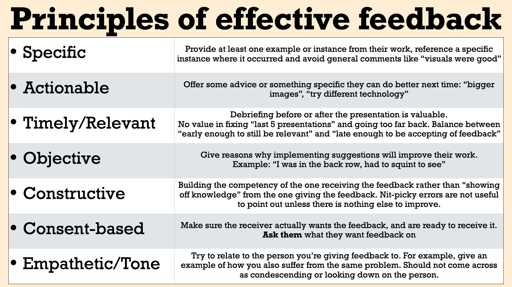

# Assignment 3

GitHub issue on the Group 05 repo: https://github.com/STAT547-UBC-2019-20/group05/issues/16

---
See the [assignment guidelines here](https://stat545.stat.ubc.ca/evaluation/assignments). 

Make sure you remember to:
  - Submit a link to the issue providing feedback you created on GitHub
  - There is NO need to do anything else in this repository

Your task for this week is to provide feedback to another group on their project.
You should focus your efforts on providing feedback on the following elements that we have focused on so far in STAT 547:

- Reproducibility of scripts
- Use of functions 
- Use of vectorized code
- Documentation of scripts and functions

You should aim to complete this assignment in about 45 minutes.

## Logistics

- The group you are reviewing can be found [here](https://github.com/STAT547-UBC-2019-20/Discussions/issues/27)
- Assignment03 should be done individually - each person will be assigned to a different group to review
- Since you are reviewing a group project, you must create an issue in the main team project repo on GitHub.com
- In your README for assignment03, please include a link to the issue you created.
- For your canvas submission, you should submit a link to the issue you created on GitHub.com (and not this repository)

## Task 1: Setting up

1. Locally, clone the repository for the project you are reviewing
2. In the repo README, find the instructions on how to reproduce all the analysis and a draft of the final report 
3. Try to reproduce the analysis and a draft of the final report from start to finish (look for the `USAGE` section)
4. Actually *run* the scripts on your computer using the commands they suggest and ensure the plots, data files, and final reports are correctly generated

## Task 2: Read through the EDA Rmd and the draft final report and provide feedback

Keep in mind that you should **make it a point to suggest things that you think are good/interesting/relevant about their project**!
People have worked hard on these over the past couple of weeks, and if you learned something new or interesting, or found someone use a bit of code in a clever way, say so!

You should think about the project as a whole but the primary purpose of this exercise is to provide feedback on the reproducibility of the project.

Guidance on what to provide feedback on:

  - Is the repository organized in a useful and sensible way?
  - Is there a `Usage` section in the README?
  - Do the scripts run to completion as described in the README?
  - Do the scripts produce the expected output? 
  - Are the scripts and functions appropriately documented?
  - Does it take a long time for the analysis to run? Are there tasks that could be vectorized to make things faster?

Provide a link to this issue in the readme and submit a link to the issue on Canvas.
  
**Optionally**, you may also provide feedback on introduction/motivation, wrangling, research questions, and visualizations.
Some questions to guide you:

  - Are the research questions appropriate and well-chosen? 
  - Are the visualizations effectively displayed? How can they be improved? 
  - Are there other, more effective visualizations that could or should be used? Does the 

In total, you should target your review to be within 200-300 words. 
You may use point form, but please make sure it's in complete 

## How will you be graded on this assignment?

You will be graded on the quality of the feedback you provide to the other group. 
Here is the rubric you will be assessed on:

This rubric is for assessing one student's peer review of another student's work.

<table>
  <tr>
    <th>No attempt (0)</th>
    <th>Poor (F)</th>
    <th>Unsatisfactory (D)</th>
    <th>Satisfactory (C- to C+)</th>
    <th>Good (B- to B+)</th>  
    <th>Excellent (A- to A+)</th>
  </tr>
  <tr>
	<td>No attempt</td>
	<td>The review is mean or disrespectful.</td>
	<td>The review is so generic that it's hard to determine which assignment it's reviewing. It doesn't offer any praise and yet doesn't offer any suggestions either.</td>
	<td> It is clear that the reviewer did not try to run the code locally and no feedback was provided either on the code/scripts or the report itself</td>
	<td> The review is too brief to be useful and does not provide much insight into either the content of the report or the scripts that were used. </td>
	<td>The review contains thoughtful, constructive and considerate comments. It is specific and concise.</td>
  </tr>
</table>

## Reminder: Providing effective feedback 

Below are some general guidelines on providing effective feedback are shown below, be sure to keep them in mind when providing your feedback.

In addition, several points of emphasis:

- Be concrete and specific: point to specific areas of the dashboard and refer to it in your feedback.
- If it is easier for you, you can use screenshots and annotations to point to specific things in the report or scripts.
- Be empathetic: when you write feedback, try to put yourself at the receiving end and think about what feedback would have been useful for you. 
- Be constructive: Do not use evaluative or judgmental language; instead be constructive and help them build on their strengths
- Tone: Don't be mean. A good test to determine whether you are being mean or not is putting yourself or a close friend at the receiving end or imagining whether you can say it to them in a face-to-face conversation.
